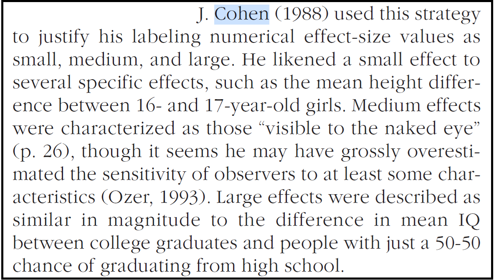
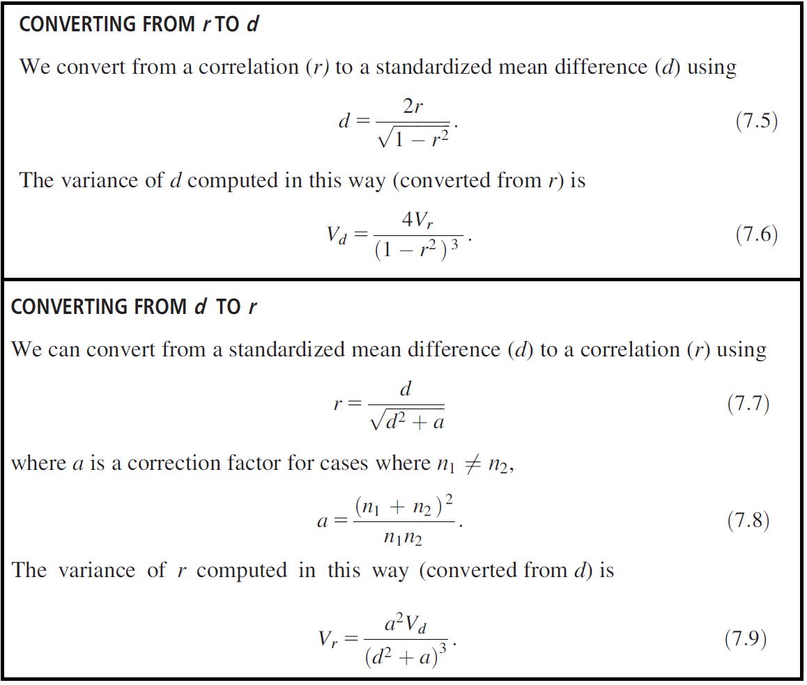
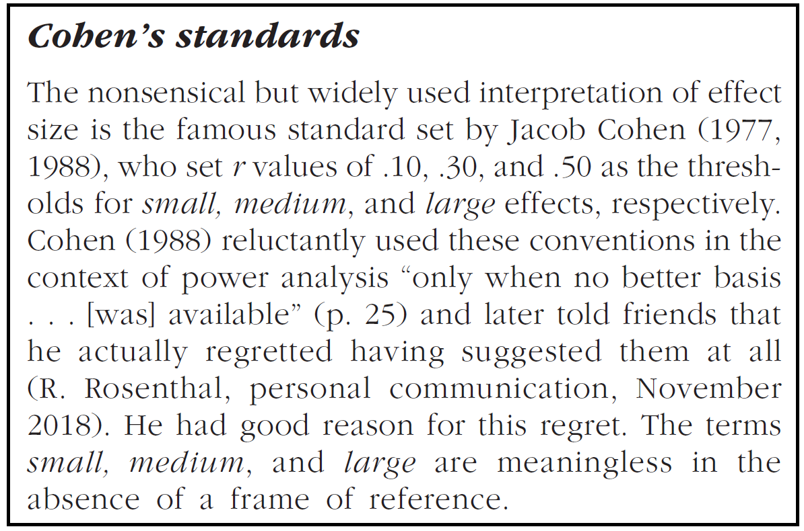
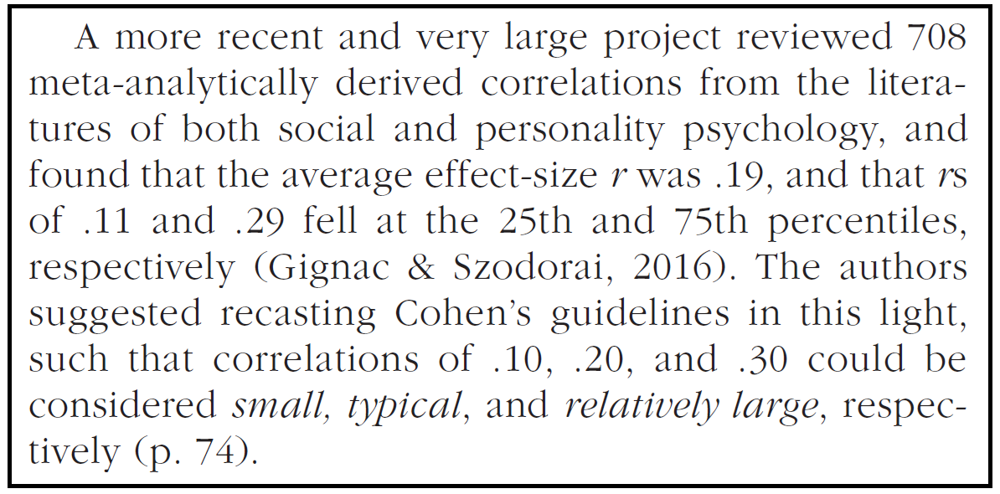

\raggedright
\break\break

```{r setup-knitr, include=FALSE} 
knitr::opts_chunk$set(warning = FALSE, message = FALSE) 
```

### Initial setup

```{r setup-general} 
rm(list=ls())
library(ggplot2)
library(MASS)
ts=25
```

----------------------------------------------------------------------------------------

----------------------------------------------------------------------------------------

----------------------------------------------------------------------------------------


# Correlation

Example of scatter plot featuring a correlation of exactly **` r = 0.40`**. 

It can be understood as a +1.00 *SD* increase in one variable corresponding to an estimated +0.40 *SD* increase in the other one. 

Standardized regression coefficient in a linear model (continuous predictor) can be interpreted in a similar fashion. 

```{r figure-correlation, cache=T, echo=FALSE, out.width="75%", fig.asp=0.7}
r = .40
df = data.frame(mvrnorm(n=1000,mu=c(0,0),Sigma=matrix(c(1,r,r,1),2,2),empirical=T))
ggplot(df,aes(x=X1,y=X2))+
  geom_point(size=3,alpha=.4,color="blue")+
  geom_smooth(method="lm",color="blue",size=2)+
  coord_cartesian(ylim=c(-2,2),xlim=c(-2,2))+
  scale_x_continuous(breaks=seq(-4,4,.50))+
  scale_y_continuous(breaks=seq(-4,4,.40))+
  theme(text=element_text(size=ts*0.7))+
  xlab("X1 (z-score)")+ylab("X2 (z-score)")+
  geom_vline(xintercept=c(0,1),linetype=2,size=1)+
  geom_hline(yintercept=c(0,.40),linetype=2,size=1)
```

----------------------------------------------------------------------------------------

----------------------------------------------------------------------------------------

----------------------------------------------------------------------------------------

# Standardized Mean Difference

SMDs (e.g., Cohen's d, possibly with Hedges' correction for small samples) are reported to compare group average values on a standardized metric. Here is an example of **`Cohen's d = 1.50`** between "<span style="color:darkgreen;">**population green**</span>" and "<span style="color:purple;">**population purple**</span>".

```{r figure-example-SMD, cache=T, echo=FALSE, out.width="75%", fig.asp=0.55}
ggplot()+
  scale_x_continuous(limits=c(-3,4),breaks=seq(-4,4,.50))+
  ylab("Density")+xlab("X1 (z-score)")+
  theme(text=element_text(size=ts*0.75),axis.text.y=element_blank())+
  geom_vline(xintercept=c(0,1.5),linetype=2,size=1)+
  stat_function(fun=dnorm,n=200,color="purple",size=2,args = list(mean = 1.50))+
  stat_function(fun=dnorm,n=200,color="darkgreen",size=2)
```

Height is commonly used for offering examples to understand SMDs, because it is an immediately visible, non-latent, more or less normally-distributed trait. For example, from *Funder and Ozer (2019)*:

```{r figure-Cohen-height-text, cache=T, echo=FALSE, out.width="50%"}

```

Is it true? Here is the WHO data with growth curves in height. In fact, it looks like there is no change at all between 16- and 17-year-old girls. 

```{r figure-height, cache=T, echo=FALSE, out.width="75%"}
load("Figures/Figure-height.RData")
gt
```

... and here is a shiny app for producing plots and computing effect sizes based on those data. 

**https://enricotoffalini.shinyapps.io/Dati_altezza_WHO/**

Indeed, for 16- vs 17-year-old girls we get **`Cohen's d = 0.05`**, which is not "small", it's practically negligible.


----------------------------------------------------------------------------------------

----------------------------------------------------------------------------------------

----------------------------------------------------------------------------------------

# Correlation and Cohen's d can be transformed into each other

From *Borenstein et al. (2009)* **SUPER** useful for meta-analysis:

```{r figure-borenstein-conversion, cache=T, echo=FALSE, out.width="60%"}

```

Let's write the conversion functions (here only for effect size estimates):

```{r conversion-functions}
r2d = function(r){
  d = 2*r / sqrt(1 - r^2)
  return(d)
}
d2r = function(d,n1=NA,n2=NA){
  if(is.na(n1)|is.na(n2)) n1=n2=1e5
  a = (n1 + n2)^2 / (n1 * n2)
  r = d / sqrt(d^2 + a)
  return(r)
}
```

EXAMPLE OF CONVERSION TABLE:

```{r conversion-examples}
tab = data.frame(Cohens.d=seq(-1.6,1.6,.2),Correlation=NA)
tab$Correlation = round(d2r(tab$Cohens.d),2)
tab
```


----------------------------------------------------------------------------------------

----------------------------------------------------------------------------------------

----------------------------------------------------------------------------------------

# Small, medium, large?

From *Funder and Ozer (2019)*:

```{r figure-cohens-standards, cache=T, echo=FALSE, out.width="60%"}

```

In fact, meta-analyses of effects in individual differences generally suggest a more sobering reality in psychological research. This makes sense! spontaneous behavior depends on a **lot** of factors, so any single effect must be small as compared to the overall observed variability:

```{r figure-metaanalisi-individual-differences, cache=T, echo=FALSE, out.width="60%"}

```

Eventually, *Funder and Ozer (2019)* suggest the following interpretation:

**` r = 0.05`** → *very small* effect "for the explanation of single events but potentially consequential in the not-very-long run"

**` r = 0.10`** → *small* effect "at the level of single events but potentially more ultimately consequential"

**` r = 0.20`** → *medium* effect "that is of some explanatory and practical use even in the short run and therefore even more important"

**` r = 0.30`** → *large* effect "that is potentially powerful in both the short and the long run"

Example by *Funder and Ozer (2019)* of a very small correlation for a single event that is relevant in the long run: 

→ Agreeableness may correlate around **` r = 0.05`** with success of a single social interaction ... But what happens at the end of the year if a person has had 20 social interactions per day? (My computation: out of 7300 interactions in a year, having +1 *SD* in agreeableness implies about +185 positive interactions.) 

→ Other example: "*very small*" treatment effect... but what happens if that *very small* effect acts every single day in the life of a person?

```{r hidden-code-example-very-small-effect, cache=FALSE, echo=FALSE, include=FALSE}
r = .09
df = data.frame(mvrnorm(n=1e6,mu=c(0,0),Sigma=matrix(c(1,r,r,1),2,2),empirical=T))
outcome1 = rbinom(nrow(df),1,pnorm(df$X2))
cor(outcome1,df$X1) # r = 0.05
outcome7300 = rbinom(nrow(df),365*20,pnorm(df$X2))
cor(outcome7300,df$X1)
fit = lm(outcome7300~df$X1)
summary(fit)
```


----------------------------------------------------------------------------------------

----------------------------------------------------------------------------------------

----------------------------------------------------------------------------------------


